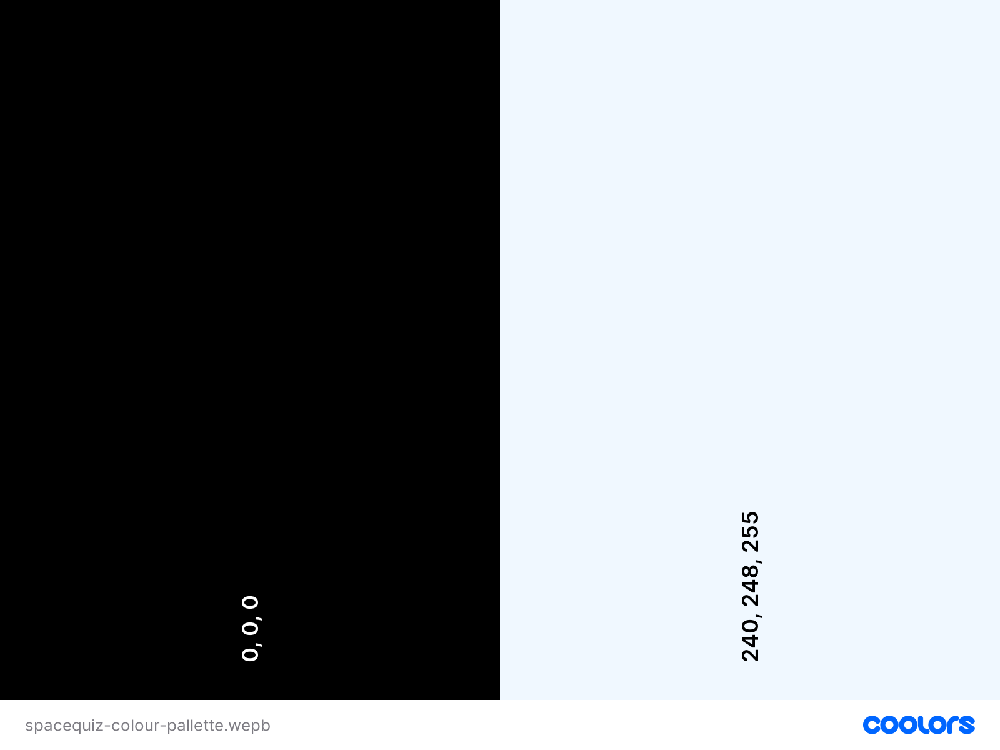

# Pilot Assessment - Space Quiz

## Overview

This project was intended to provide an engaging and fun quiz for users to test their knowledge on space and the solar system.

Please use the link below to view the live, deployed site:

[Oda Nobunaga Live Site](https://tomlidev.github.io/Oda-Nobunagav1/)

## CONTENTS

- [User Experience](#user-experience)

- [User Stories](#user-stories)

- [Design](#design)

- [Colour Scheme](#colour-scheme)

- [Typography](#typography)

- [Imagery](#imagery)

- [Wireframes](#wireframes)

- [Features](#features)

- [General Features on All Pages](#general-features-on-all-pages)

- [Homepage](#homepage)

- [Rise Page](#rise-page)

- [Reign Page](#reign-page)

- [Legacy Page](#legacy-page)

- [Sign Up Form](#sign-up-form)

- [Thank you Page](#thank-you-page)

- [404 Error Page](#404-error-page)

- [Future Implementations/Plans](#future-implementationsplans)

- [Accessibility](#accessibility)

- [Technologies Used](#technologies-used)

- [Deployment](#deployment)

- [Local Development](#local-development)

- [Testing](#testing)

- [Credits](#credits)

- [Acknowledgements](#acknowledgements)

## User Experience

Space Quiz is a website which provides a fun and engaging quiz for users to test their knowledge on space and the solar system, whilst learning more about both.

Key Features:

- Begin! The option to begin a new quiz.

- How to play - Instructions for how to go through the quiz.

- Leaderboard - Rankings of players by scores.

### User Stories

#### First Time Visitors

As a first time visitor I want to understand how to play the quiz and have the ability to start the quiz quickly and easily. I want to know which questions I get right and wrong, if wrong, I want to know what the correct answer was. Once completed, I want to know my overall score and how that compares to others.

I want a prompt to come back and play again in the future.

#### Return Visitor

As a return visitor I have to be able to easily check my past score against other players. I want to be able to start a new quiz without having to read through the instructions. Ideally I want to have a variety of questions so that when I come back to do the quiz again I am not getting the same questions. The ability to choose a different difficulty would also keep the game interesting.

## Design

### Colour Scheme

I knew the colour scheme would be driven largely by the colours of the background images used on the home page. This would mean using black and potentially some dark purple/blue. I will then use a pale blueish offwhite for sections that I wanted to highlight and bring attention to, such as menu containers, to provide contrast against the background and provide contrast for a dark text colour. The colour pallette is however kept very simple and driven largely by the space background, which is deliberate.

### Typography

I used the font Exo 2 from google fonts for the site. I experimented with other font types to see which gave a futuristic sci fi feel, without making the text too outlandish or difficult to read. I feel that Exo 2 meets this requirement nicely, and when capitalised works well in the nav bar also.

[Image of Garamond, Font Used on Website](documentation/Exo2-font.PNG)

San's serif is used as the back-up font if FONT cannot be loaded for any reason.

### Imagery

I want to keep the imagery quite simple as I don't want too much on-screen to distract from the quiz questions. The main image used will be the space background image, this provides a nice back drop that also has a bit of variety in the colours.

[The background image](documentation/spacequiz-background1.webp)

I may also use images of planets/stars etc in the leaderboard and other pages that are not quiz question pages to provide variety.

Some simple icons will also be used but the pages will be without big images as I want to keep the focus on the quiz and questions.

### Wireframes

Please use the links below to view the relevant wireframe.

[Homepage Wireframe](https://share.balsamiq.com/c/v3qHooymfGyyEyCx9uEb9t.png)

[Rise Page Wireframe](https://share.balsamiq.com/c/4XHgkXZpHDEm6hsLnyTWFw.png)

[Reign Page Wireframe](https://share.balsamiq.com/c/dZwjwN7p92MaoszVH6QtVR.png)

[Legacy Page Wireframe](https://share.balsamiq.com/c/nqA2hcoZaDui433BzNUciM.png)

[Homepage Mobile Wireframe](https://share.balsamiq.com/c/kboxySvsPoZ6vGataXtcPX.png)

[Rise Page Mobile Wireframe](https://share.balsamiq.com/c/pRRHV5QAdkH1ZwD97XFLDr.png)

[Reign Page Mobile Wireframe](https://share.balsamiq.com/c/xgnLqqmHmFKpsLG5Rzr7hB.png)

[Legacy Page Mobile Wireframe](https://share.balsamiq.com/c/h6eQVWLUi3Vt7jMPAzWmto.png)

[404/Thank you page, Desktop and Mobile Wireframe](https://share.balsamiq.com/c/tzDT9VJSwPWJCvZkviFija.png)

[Form page Desktop and Mobile Wireframe](https://share.balsamiq.com/c/8oWTJvxPUwHagAJNFR4EmU.png)

## Features

### General Features On All pages

#### Header/Nav Bar

Every page has the same navigation bar at the top, comprising a planet Earth icon and the word home in the top left. This is a link which takes the user back to the home page. In the right of the bar the user has the option to jump to the Leaderboard, I may also include a call to action such as - sign up for competitions/stay informed, which will bring the user to a sign up. Both these links will be made up of icons and text as a link to the relevant pages. I did experiment with just using an Icon or just using text but I feel the combination looks the best and provides the best navigation for the user.

#### Footer

Every page has the same footer bar comprising icon links to Facebook, Instagram, Twitter and Linkedin.

I did originally have this footer in a black bar running the length of the bottom of the screen, but this looked a little odd so I tried the icons simply floating as the bottom and I think this looks much nicer and cleaner.

### Homepage

On the homepage the user is presented with the options to Start a new quiz, view instructions in How to play and View the leaderboard. Each of these buttons sit centrally in the middle of the page, held within a semi-transparent menu that sits on top of the space background image. The nav bar is at the top of the page and the social media links sit at the bottom.

### Instructions Page

The instructions page will present the user with a simple, short list of instuctions on how to play the game. As the game is a quiz and the options to select an answer in relation to the question being displayed are fairly obvious and intuitive the instructions will be brief.

### Username Page

If the user selects to begin a quiz they will be presented with a page which asks them to enter a user name. This value will be passed through the quiz for use in the leaderboard later is the player scores highly enough.

### Quiz Start

The Quiz Start page wil be visually similar to the home page. The key difference being the text in the central menu will be a question and the buttons below this will be options to select different answers.

I will create this page so that when the user selects an option Javascript will be listening for the button click. If the user selects the correct answer then the button will be highlighted in green, a correct score will be added to the score counter and the next question will be loaded.

If the user selects an incorrect answer, the answer that they clicked will be highlighted in red, and the correct answer will be highlighted in green. No score will be recored, or an incorrect score will be tallied if I decide to incorporate negative scoring for incorrect answers.

Once the answer has been selected, the relevant on screen styling has occured, and the relevant scoring mechanism has taken place, Javascript will be used to change the content of the questions/answers and display the user with a new question. I will create a reasonably large datastructure to hold multiple questions that can be pulled, at random, into a quiz of 5 - 10 questions, so that the user has a good chance of getting a mixture of different questions each time they do the quiz.

The ALGORITHM will be used to shuffle the question bank each time the quiz is loaded to ensure that the order of questions is different each time the player plays.

At the end of the quiz the users final score will be passed to the results page.

IMAGE

### Result Page

The result page will be shown to the user at the end of the quiz. It will show the final calculated score from the quiz with some text stating well done!

The player will then have a button to take them to the leaderboard and show them if/where their score has ranked.

### Sign Up Form

### Thank you page

### 404 Error Page

### Leaderboard

The leaderboard page will be shown after the user has viewed their final result, or if the player chooses to navigate to the leaderboard directly from the home page. This will consist of a table showing the ranking, name and score of other players results.

Time permitting, I would like to incorporate some code so that if the player has scored highly enough to enter the leaderboard, their name/score/ranking row is highlighted so it is obvious.

## Future Implementations/Plans

In the future I would like to incorporate:

A timer - Could be used to make the game more dynamic with a set time in which to answer the question. This could also be used as a way of providing a greater difficulty, with less time to answer a question on the higher difficulty setting.

User entering a name - I'd like to give the user an option to enter their name when starting the quiz. This would add a nice touch of personalisation and would make the Leaderboard much more interesting.

Difficulty Options - I'd like to give users the ability to choose between difficulties to give the game longer term appeal for return users and generally increased the scope and playability of the game.

### Accessibility

This site has been built to be as accessible as possible, specifically:

- All images have alt text attributes and all anchors have aria labels for use by screen readers.

- The colour scheme has been chosen to ensure a good level of contrast is maintained for text across the site.

- Semantic markup has been used throughout.

- Including hover states to aid navigation.

## Technologies Used

### Languages Used

HTML, CSS and Javascript are used.

### Libraries and External Sources

- Git - Version control.

- Github - To save and store code for the website itself.

- Github pages - To deploy the live site.

- Code anywhere - The workspace and IDE for producing the site.

- Balsamiq - wireframes

- Coolors - Colour Palette

- Google fonts - For imported fonts

- Font Awesome - For header and footer icons

- Google Developer Tools - For troubleshooting/bug resolution and testing responsiveness

- W3C Validators - For checking validity of HTML and CSS.

- JSHint - Used to check the validity and quality of Javascript.

- Am I Responsive? - To create images of website on range of device screens.

## Deployment

This was website was deployed using Github pages. Instructions to do this are:

1. Go to Github and Log in (or sign up).

2. Find the repository for this project, TomLiDev/Oda-Nobunagav1.

3. Click on the Settings link.

4. Click on the Pages link in the left hand side navigation bar.

5. In the Source section, choose main from the drop down select branch menu. Select Root from the drop down select folder menu.

6. Click Save. Your live Github Pages site is now deployed at the URL shown.

## Local Development

### How to fork

1. Log in (or sign up) to Github.

2. Go to the repository for this project, TomLiDev/Oda-Nobunagav1.

3. Click the Fork button in the top right corner.

### How to clone

1. Log in (or sign up) to GitHub.

2. Go to the repository for this project, TomLiDev/Oda-Nobunagav1.

3. Click on the code button, select whether you would like to clone with HTTPS, SSH or GitHub CLI and copy the link shown.

4. Open the terminal in your code editor and change the current working directory to the location you want to use for the cloned directory.

5. Type 'git clone' into the terminal and then paste the link you copied in step 3. Press enter.

## Testing

Please see seperate testing.md for full details.

[Testing](TESTING.md)

## Credits

### Code Used

The following sites were used for code:

####

Make it random algorithm.

Passing value from one page to another in session storage.

### Content

The majority of the content was created by the author.

This site was used for the background image.

Some of the questions were taken/inspired from this website.

## Acknowledgements

- Graeme Taylor - My Code Institute Mentor

- My family - For your help in testing, playing my game and providing feedback.
