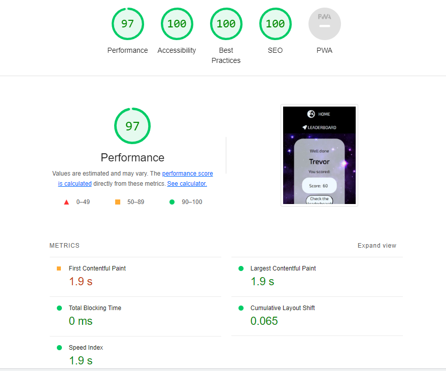

# Space Quiz - Testing

## Testing

Testing was conducted at several stages throughout the development using Google Chrome Developer tools and later W3C validators.

Early issues identified in meetings with my mentor were:

- Maintaining good comments throughout the code, particularly in Javascript to explain functions.
- Seperating Javascript functions into smaller functions to make them more manageable.
- Storing values so that they can be passed from one page to another.

Later issues on first deploying my website, reviewed with my mentor were:

- Having the leaderboard remain updated/changed after receiving values and not reverting back to original.
- Some styling issues where questions with larger answers would overflow the answers section.

## CONTENTS

- [Automated Testing](#automated-testing)
- [W3C Validator](#w3c-validator)
- [Lighthouse Testing](#lighthouse-testing)
- [Wave Testing](#wave-testing)
- [Manual Testing](#manual-testing)
- [First Time Visitors](#first-time-visitors)
- [Return Visitors](#return-visitor)
- [Full Testing](#full-testing)
- [Homepage](#homepage)
- [Rise Page](#rise-page)
- [Reign Page](#reign-page)
- [Legacy Page](#legacy-page)
- [Form Page](#form-page)
- [Thank you Page](#thankyou-page)
- [404 Error Page](#404-error-page)
- [Bugs](#bugs)
- [Solved Bugs](#solved-bugs)
- [Known Issues](#known-issues)

## Automated Testing

### W3C Validator

The W3C validator was used to validate all HTML pages and CSS in the style.css.

- [Screenshot of CSS W3C Validated](documentation/css-validated.PNG)
- [Screenshot of index page W3C Validated](documentation/index-w3c.png)
- [Screenshot of username page W3C Validated](documentation/username-w3c.png)
- [Screenshot of quiz start page W3C Validated](documentation/quiz-start-w3c.png)
- [Screenshot of results page W3C Validated](documentation/result-w3c.png)
- [Screenshot of leaderboard W3C Validated](documentation/leaderboard-w3c.png)
- [Screenshot of 404 error page W3C Validated](documentation/error-page-w3c.png)

### Lighthouse Testing

Google chrome Lighthouse tester was used to assess SEO score, acccessibility, conformance to best practices and overall performance. Please use the links below to view scores for each page on desktop or mobile:

#### Homepage Desktop Lighthouse Scores

#### Homepage Mobile Lighthouse Scores

#### Username page Desktop Lighthouse Scores

#### Username Page Mobile Lighthouse Scores

#### Quiz Start Desktop Lighthouse Scores

#### Quiz Start Mobile Lighthouse Scores

#### Results Page Lighthouse Scores

#### Results Page Mobile Lighthouse Scores

#### Leaderboard Desktop Lighthouse Scores

#### Leaderboard Mobile Lighthouse Scores

#### 404 Error Page Desktop Lighthouse Scores

#### 404 Error Page Mobile Lighthouse Scores

#### Thankyou page Desktop Lighthouse Score with refresh removed

#### Findings and Actions

Overall I am very pleased with the Lighthouse scores for my pages. Some of the mobile pages has lower scores for performance, which seemed to be related to the size of the background image. I did consider changing this, however the background was already in a webp format, and worked very well with the overall style and colour scheme. I therefore kept the background as it was only a minor issue on some of the pages from a mobile view.

The vast majority of the scores however are 100% or extrememly close to, so I am pleased that the work put into accessibility and performance has paid off across the vast majority of the pages.

In the future I would look at potentially scaling back the background for smaller screen sizes in some way, but from initial investigation this had major impacts on the over all look and feel of the pages, so was not something I could work into the scope of this project.

### WAVE Testing

Each page was assessed using the WAVE accessibility tool. Every page passed without any errors, please use the links below to view the scores for each page:

- [Homepage WAVE Test](documentation/index-wave.png)
- [Username page WAVE Test](documentation/username-wave.png)
- [Quiz Start WAVE Test](documentation/quiz-start-wave.png)
- [Result page WAVE Test](documentation/result-wave.png)
- [Leaderboard WAVE Test](documentation/leaderboard-wave.png)
- [404 page WAVE Test](documentation/error-page-wave.png)

A warning which was raised during the wave testing was that the pages used h2 elements instead of h1. As this was a relativley simple change I replaced the h2 elements with h1's where necessary.

Some of the other pages have similar warnings where the WAVE program thought that text was a possible h2, and should have been made as such, but these were for small pieces of text such as "score" inside the final score box, so semantically I didn't think it made sense to make these headings when they are more similar to labels.

The wave testing also flagged the "check leaderboard" button on the results page as redundant, as there was the same link the nav bar, but I kept this in as I felt it was good UX, and I didn't want to change the nav bar purely for one page.

No errors were raised on any page.

## Manual Testing

### Testing User Stories

#### First Time Visitors

| Aim                                                 | How does the site achieve this?                                                                                                                                                                                                   |
| :-------------------------------------------------- | :-------------------------------------------------------------------------------------------------------------------------------------------------------------------------------------------------------------------------------- |
| Find out how to play the game                       | The how to play option, accessible from the home page, gives clear instruction on how to play the game                                                                                                                            |
| Start the quiz easily                               | The quiz can be started very easily and quickly from the option on the home screen, or immediatly from the the instructions page to save navigating back to the home page                                                         |
| Know which questions I got right and wrong          | Each question highlights the correct answer in green when an answer is clicked on. If the anser that has been clicked is incorrect this is highlighted in red                                                                     |
| Know final score and how I compare to other players | Final score is returned to the player at the end of the quiz with the option to see if that score has been enough to make the leaderboard with a message to confirm whether or not the player has made the leaderboard on viewing |

#### Return Visitor

| Aim                                                    | How does the site achieve this?                                                                                                                                         |
| :----------------------------------------------------- | :---------------------------------------------------------------------------------------------------------------------------------------------------------------------- |
| Quickly understand if my score is still in leaderboard | Every page has the option to navigate to the leaderboard in the nav bar at the top, players can go to view their previous scores at any time without doing another quiz |
| Start a new quiz                                       | A new quiz can be started from the home screen, or directly from the leaderboard, to save having to go to the home page                                                 |

## Full Testing

Full testing of the website was performed on a Dell optiplex desktop on 25 inch Toshiba and Soundwave monitors, Dell Lattitude 5510 14 inch screen laptop, iPad 8th generation, Samsung Galaxy S10, iPhone 14 pro.

Google chrome developer tools was also used to test at a range of different pixel sizes.

Testing was conducted using Google Chrome, MS Edge and Safari.

### Homepage

| Feature/Function  | Expected Outcome                            | Method of Test    | Result                       | Pass/Fail |
| :---------------- | :------------------------------------------ | :---------------- | :--------------------------- | :-------- |
| NAVBAR            |                                             |                   |                              |
| Home Link         | Return/refresh home page on click           | Clicked link      | Returned to home             | Pass      |
| Home Link Hover   | Underline appears under text.               | Hovered over link | Underline appeared           | Pass      |
| Leaderboard Link  | Return/refresh to Leaderboard page on click | Clicked link      | Returned to Leaderboard page | Pass      |
| Leaderboard Hover | Underline appears under text.               | Hovered over link | Underline appeared           | Pass      |

FOOTER | | | |
| Facebook Icon Link | Opens Facebook in seperate browser on click | Clicked icon | Opened Facebook in seperate tab | Pass |
| Instagram Icon Link | Opens Instagram in seperate browser on click | Clicked icon | Opened Instagram in seperate tab | Pass |
| Twitter Icon Link | Opens Twitter in seperate browser on click | Clicked icon | Opened Twitter in seperate tab | Pass |
| Linkedin Icon Link | Opens Linkedin in seperate browser on click | Clicked icon | Opened Linkedin in seperate tab | Pass |
| HOMEPAGE | | | |
| Begin! Link | When clicked user will be directed to username page | Clicked link | Redirected to username page | Pass |
| How to play Link | When clicked user will be redirected to instructions page | Clicked link | Redirected to instructions page | Pass |
| Leaderboard Link | When clicked user will be redirected to Leaderboard page | Clicked link | Redirected to Leaderboard page | Pass |

### Username Page

| Feature/Function  | Expected Outcome                            | Method of Test    | Result                       | Pass/Fail |
| :---------------- | :------------------------------------------ | :---------------- | :--------------------------- | :-------- |
| NAVBAR            |                                             |                   |                              |
| Home Link         | Return/refresh home page on click           | Clicked link      | Returned to home             | Pass      |
| Home Link Hover   | Underline appears under text.               | Hovered over link | Underline appeared           | Pass      |
| Leaderboard Link  | Return/refresh to Leaderboard page on click | Clicked link      | Returned to Leaderboard page | Pass      |
| Leaderboard Hover | Underline appears under text.               | Hovered over link | Underline appeared           | Pass      |

FOOTER | | | |
| Facebook Icon Link | Opens Facebook in seperate browser on click | Clicked icon | Opened Facebook in seperate tab | Pass |
| Instagram Icon Link | Opens Instagram in seperate browser on click | Clicked icon | Opened Instagram in seperate tab | Pass |
| Twitter Icon Link | Opens Twitter in seperate browser on click | Clicked icon | Opened Twitter in seperate tab | Pass |
| Linkedin Icon Link | Opens Linkedin in seperate browser on click | Clicked icon | Opened Linkedin in seperate tab | Pass |
| Username Page | | | |
| Enter Name Field | When clicked placeholder text will clear OR user will get suggestions for previous names | Clicked in field | Placeholder text cleared OR given suggestions to select from previous name which populate field | Pass |
| Start Quiz! | When clicked user will be redirected to quiz-start page and first question will be presented | Clicked link | Redirected to quiz-start page and first question loaded | Pass |

### Insructions Page

| Feature/Function  | Expected Outcome                            | Method of Test    | Result                       | Pass/Fail |
| :---------------- | :------------------------------------------ | :---------------- | :--------------------------- | :-------- |
| NAVBAR            |                                             |                   |                              |
| Home Link         | Return/refresh home page on click           | Clicked link      | Returned to home             | Pass      |
| Home Link Hover   | Underline appears under text.               | Hovered over link | Underline appeared           | Pass      |
| Leaderboard Link  | Return/refresh to Leaderboard page on click | Clicked link      | Returned to Leaderboard page | Pass      |
| Leaderboard Hover | Underline appears under text.               | Hovered over link | Underline appeared           | Pass      |

FOOTER | | | |
| Facebook Icon Link | Opens Facebook in seperate browser on click | Clicked icon | Opened Facebook in seperate tab | Pass |
| Instagram Icon Link | Opens Instagram in seperate browser on click | Clicked icon | Opened Instagram in seperate tab | Pass |
| Twitter Icon Link | Opens Twitter in seperate browser on click | Clicked icon | Opened Twitter in seperate tab | Pass |
| Linkedin Icon Link | Opens Linkedin in seperate browser on click | Clicked icon | Opened Linkedin in seperate tab | Pass |
| Instructions Page | | | |
| Begin! Button | When clicked user will be returned to username page | Clicked button | Returned to username page | Pass |

### Quiz Start

| Feature/Function  | Expected Outcome                            | Method of Test    | Result                       | Pass/Fail |
| :---------------- | :------------------------------------------ | :---------------- | :--------------------------- | :-------- |
| NAVBAR            |                                             |                   |                              |
| Home Link         | Return/refresh home page on click           | Clicked link      | Returned to home             | Pass      |
| Home Link Hover   | Underline appears under text.               | Hovered over link | Underline appeared           | Pass      |
| Leaderboard Link  | Return/refresh to Leaderboard page on click | Clicked link      | Returned to Leaderboard page | Pass      |
| Leaderboard Hover | Underline appears under text.               | Hovered over link | Underline appeared           | Pass      |

FOOTER | | | |
| Facebook Icon Link | Opens Facebook in seperate browser on click | Clicked icon | Opened Facebook in seperate tab | Pass |
| Instagram Icon Link | Opens Instagram in seperate browser on click | Clicked icon | Opened Instagram in seperate tab | Pass |
| Twitter Icon Link | Opens Twitter in seperate browser on click | Clicked icon | Opened Twitter in seperate tab | Pass |
| Linkedin Icon Link | Opens Linkedin in seperate browser on click | Clicked icon | Opened Linkedin in seperate tab | Pass |
| Quiz Start | | | |
| Click correct Answer | When clicked user will have their selected button highlighted in green, all buttons will be disabled until next question, a score of 10 will be added to current score | Clicked correct answer | Correct answer/answer clicked highlighted in green, all buttons disabled until next question, score of 10 added | Pass |
| Click incorrect Answer | When clicked user will have their selected button highlighted in red, correct answer will be highlighted in green, all buttons will be disabled until next question, a score of 10 will be added to current score | Clicked incorrect answer | Clicked answer/incorrect answer highlighted in red, correct answer highlighted in green, all buttons disabled until next question | Pass |
| Next question load | After correct/incorrect action, 2 seconds pass and then next question loaded with answer buttons enabled | Clicked Answer | 2 seconds pass and next question loaded with answer buttons enabled | Pass |
| Max questions reached | At max questions answered quiz is ended and user redirected to results page | Max questions reached | Returned to results page | Pass |

### Result Page

| Feature/Function  | Expected Outcome                            | Method of Test    | Result                       | Pass/Fail |
| :---------------- | :------------------------------------------ | :---------------- | :--------------------------- | :-------- |
| NAVBAR            |                                             |                   |                              |
| Home Link         | Return/refresh home page on click           | Clicked link      | Returned to home             | Pass      |
| Home Link Hover   | Underline appears under text.               | Hovered over link | Underline appeared           | Pass      |
| Leaderboard Link  | Return/refresh to Leaderboard page on click | Clicked link      | Returned to Leaderboard page | Pass      |
| Leaderboard Hover | Underline appears under text.               | Hovered over link | Underline appeared           | Pass      |

FOOTER | | | |
| Facebook Icon Link | Opens Facebook in seperate browser on click | Clicked icon | Opened Facebook in seperate tab | Pass |
| Instagram Icon Link | Opens Instagram in seperate browser on click | Clicked icon | Opened Instagram in seperate tab | Pass |
| Twitter Icon Link | Opens Twitter in seperate browser on click | Clicked icon | Opened Twitter in seperate tab | Pass |
| Linkedin Icon Link | Opens Linkedin in seperate browser on click | Clicked icon | Opened Linkedin in seperate tab | Pass |
| Results Page | | | |
| Player name | When returned to result page, player name inputted on username field to show in space between Well done and You Scored text | Returned to page | Inputted player name shown in space between Well done and You Scored text | Pass |
| Player Score | When returned to result page, player score should be taken and displayed next to Score: | Returned to page | Correct player score shown next to Score: | Pass |
| Check the leaderboard link | When clicked, return use to the leaderboard | Clicked link | Returned to leaderboard | Pass |

### Leaderboard

| Feature/Function  | Expected Outcome                            | Method of Test    | Result                       | Pass/Fail |
| :---------------- | :------------------------------------------ | :---------------- | :--------------------------- | :-------- |
| NAVBAR            |                                             |                   |                              |
| Home Link         | Return/refresh home page on click           | Clicked link      | Returned to home             | Pass      |
| Home Link Hover   | Underline appears under text.               | Hovered over link | Underline appeared           | Pass      |
| Leaderboard Link  | Return/refresh to Leaderboard page on click | Clicked link      | Returned to Leaderboard page | Pass      |
| Leaderboard Hover | Underline appears under text.               | Hovered over link | Underline appeared           | Pass      |

FOOTER | | | |
| Facebook Icon Link | Opens Facebook in seperate browser on click | Clicked icon | Opened Facebook in seperate tab | Pass |
| Instagram Icon Link | Opens Instagram in seperate browser on click | Clicked icon | Opened Instagram in seperate tab | Pass |
| Twitter Icon Link | Opens Twitter in seperate browser on click | Clicked icon | Opened Twitter in seperate tab | Pass |
| Linkedin Icon Link | Opens Linkedin in seperate browser on click | Clicked icon | Opened Linkedin in seperate tab | Pass |
| Leaderboard | | | |
| Well done! Alert | On being returned to leaderboard, if score is high enough to make leaderboard, alert appears on screen, saying Well done! Leaderboard shuffled accordingly (below) | Returned to page with high enough score | Well done! Alert | Pass |
| Not this time pilot, try again. Alert | When returned to leaderboard with score lower than lowest score on leaderboard, alert will appear with text Not this time pilot, try again. | Returned to page with low score | Not this time pilot, try again. Alert | Pass |
| Leaderboard reorder | If player score is high enough, after clicking okay on alert, leaderboard is shuffled with player score and name inputted into relevant rank | Clicked alert after high enough score | leaderboard reordered with name and score inputted into correct rank | Pass |

### 404 Error Page

| Feature/Function  | Expected Outcome                            | Method of Test    | Result                       | Pass/Fail |
| :---------------- | :------------------------------------------ | :---------------- | :--------------------------- | :-------- |
| NAVBAR            |                                             |                   |                              |
| Home Link         | Return/refresh home page on click           | Clicked link      | Returned to home             | Pass      |
| Home Link Hover   | Underline appears under text.               | Hovered over link | Underline appeared           | Pass      |
| Leaderboard Link  | Return/refresh to Leaderboard page on click | Clicked link      | Returned to Leaderboard page | Pass      |
| Leaderboard Hover | Underline appears under text.               | Hovered over link | Underline appeared           | Pass      |

FOOTER | | | |
| Facebook Icon Link | Opens Facebook in seperate browser on click | Clicked icon | Opened Facebook in seperate tab | Pass |
| Instagram Icon Link | Opens Instagram in seperate browser on click | Clicked icon | Opened Instagram in seperate tab | Pass |
| Twitter Icon Link | Opens Twitter in seperate browser on click | Clicked icon | Opened Twitter in seperate tab | Pass |
| Linkedin Icon Link | Opens Linkedin in seperate browser on click | Clicked icon | Opened Linkedin in seperate tab | Pass |
| Instructions Page | | | |
| Back to home | When clicked user returned to home page | Clicked button | Returned to homepage | Pass |

## Bugs

### Solved Bugs

1. Passing Variables from Page to Page - Finding a reliable method to pass a variable value from one page to another took considerable time. Initially I explored using a 'hidden' HTML element somewhere on the page to store the values which could then be retrieved, but this was clunky and not a good solution. This was a major bug as I wanted to pass the username and user score through the quiz. Eventually using the session storage proved the best solution as this allowed values such as username and final score to be passed across the pages, but would not be stored permanently as with local storage. It took time to get this to work as intended as it wasn't clear for some time that with session.storage, the variable must be retrieved and declared for each page/function that needs to use it.

2. Question Selection - A method of getting questions from the question bank to display to the user was a challenge. I wanted this order of questions to be different each time so the quiz stayed interesting. Initially I explored using a random number generating function, then using this number to select a question object from the question bank, put this question into an array, then have this array populate the questions and answers fields as the user selected answers. This method could have probably been made to work, but would have had the issue of making sure the same question was not selected twice. On discussing it with my mentor, he suggested the Fisher-Yates shuffle algorithm. After investigating, this was a neater solution as it created a completely randomised selection of questions from the existing question bank, which meant a simple i++ loop could be used to cycle through the questions. As long as the shuffle function was run at the beginning of each quiz the order of questions would be different and there was no chance the same question could be asked twice.

3. Highlighting on Correct/Incorrect Answer - I wanted to introduce some visual colour highlighting to the user to make the quiz more visually exciting and give a clear indication on which questions they have answered correclty and which they have not. Initially this was challenging because as soon as an answer was given, the function would load the next question and the styling would be almost instantly lost. To get round this, I introduced a timer which would delay the loading of the next question so the user had time to view the correct/incorrect answer. However this introduced another issue detailed below.

4. Answer one question multiple times - For the correct/incorrect styling described above, I wanted the user to have a short period of time to view their answer and whether or not this was correct before the quiz loaded the next question. To do this I simple introduced a short timer from the point on an answer being clicked, until the next question is loaded. This worked well for the styling, a simple 2 second delay worked well to view the styling. However it did introduce the possibility that a user could click multiple answers for the same question, creating a large score from one question. This also has the knock on effect that if a user clicked the correct answer say 4 times, they would get a score of 40 for only answering one question correctly, but also then the quiz would immedialty load through the next 4 questions in quick succession, essentially breaking the quiz. The simple solution would be to remove the delay and have the next question load immediatly when an answer was clicked, but this would make any correct/incorrect answer styling impossible. My mentor suggested a simple solution of disabling the buttons, which I was unaware existed. Having this come into effect when the answer was clicked, and then set back to enabled when the next question was loaded, solved the issue and allowed me to keep the correct/incorrect styling.

5. Leaderboard Ranking - Creating the leaderboard was challening, in particular having a new score and username enter the leaderboard in the correct row and move the other scores accordingly. After trying many different options I eventually found a solution on a stack overflow page which showed how to compare and sort objects in an array by the values of a particular property in that array. This allowed me to create an array from the scores already in the leaderboard, pop the lowest score off this array, enter the new score, sort the array so that the new score was placed in its corresponding rank. Then these values can be fed back into the leaderboard to create a new, updated leaderboard with the users name and score in the correct rank.

Unfortunately the leaderboard does not retain these new updated values permanently, despite exploring options with local storage and document write functions. However after discussing this with my mentor it was explained that a permanently updated leaderboard was considered beyond the scope of this project as it would involve some kind of database which could store the values. This is something I would like to explore in a future version the game.

6. Hover on home icon - Initially the hover pseudo class underlined the HOME text and the a line appeared under the globe icon as well. After some restructuring of the HTML the desired effect was achieved.

### Known Issues

2. Map on Rise Page
